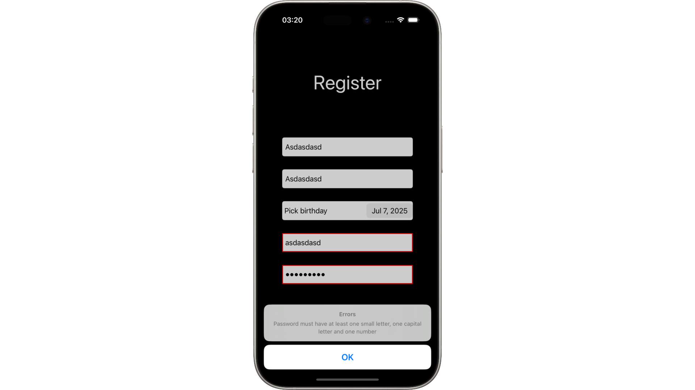

# Тестовый проект для стажироки в ЦФТ
___
#### Проект был написан с помощью UIKit, также использовался KingFisher для загрузки фото.

##### 1. Скриншот основного меню приложения. Кнопка для вызова модального окна и таблица с данными.

##### 2. Скриншот модального окна. Имя берется из UserDefaults.

##### 3. Скриншот окна с подробной информацией о позиции. Появляется при нажатии на элемент TableView.

##### 4. Скриншот экрана с первичной регистрацией пользователя.

##### 5. Скриншот экрана при невалидных данных на этапе регистрации.
